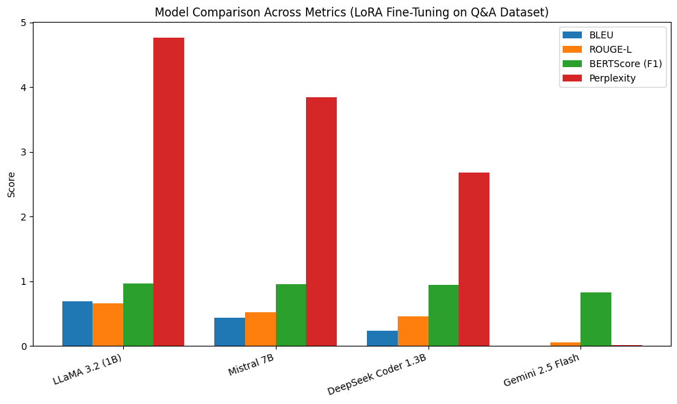
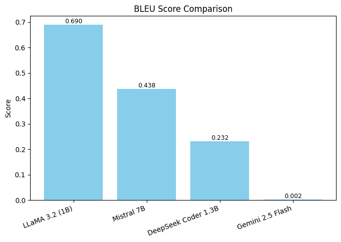
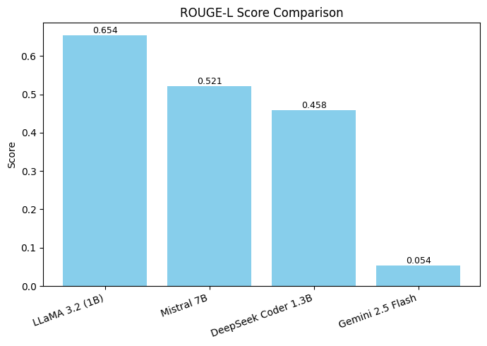
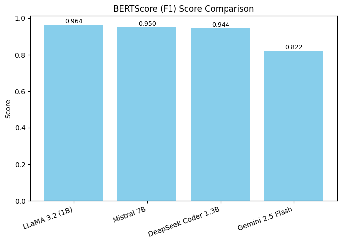
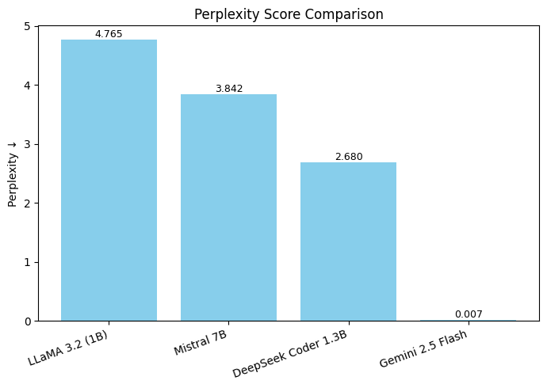
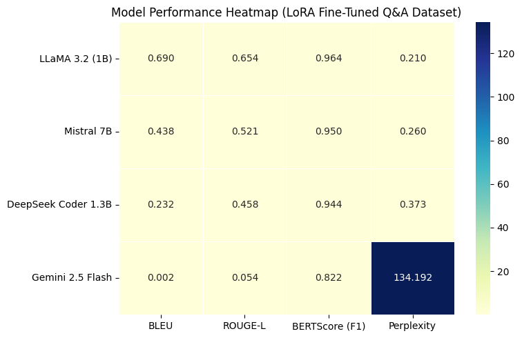

##  LoRA Fine-Tuning Results on Custom Q&A Dataset

This experiment evaluated four LLMs — **LLaMA 3.2 (1B)**, **Mistral 7B**, **DeepSeek Coder 1.3B**, and **Gemini 2.5 Flash** — after LoRA fine-tuning using a domain-specific Q&A dataset designed for business agent interaction.

###  Overall Comparison

###  Individual Metric Analysis

####  BLEU Score

> Measures similarity between generated and reference answers.  
> **LLaMA 3.2 (1B)** achieved the highest BLEU, showing superior response accuracy.

####  ROUGE-L

> Evaluates overlap between generated and reference text sequences.  
> LLaMA 3.2 also dominated here, indicating better content preservation.

####  BERTScore (F1)

> Captures semantic similarity using contextual embeddings.  
> LLaMA 3.2 led again, showing stronger semantic coherence.

####  Perplexity

> Measures text fluency — lower is better.  
> **DeepSeek Coder 1.3B** achieved the lowest Perplexity, indicating smoother language modeling.

---

>  **Insight:**  
> - LLaMA 3.2 (1B) offers the most accurate and coherent answers.  
> - DeepSeek Coder 1.3B balances coherence with fluency.  
> - Gemini 2.5 Flash performed poorly under LoRA fine-tuning for Q&A datasets.

###  Heatmap Overview

> The heatmap highlights relative model performance.  
> - **LLaMA 3.2 (1B)** dominates most metrics.  
> - **DeepSeek Coder 1.3B** shows strong fluency (low perplexity).  
> - **Gemini 2.5 Flash** underperforms across the Q&A dataset.
